# Oomp Teardown Label Printer Niimbot D110
Oomp Teardown Label Printer Niimbot D110

Oomp Teardown Label Printer Niimbot D110  
# disassembly

## step: 1 in box
[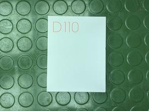](images/disassembly_1.jpg)  
boxed up

## step: 2 front
[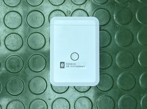](images/disassembly_2.jpg)  
front assembled

## step: 3 open
[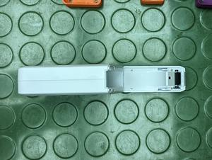](images/disassembly_3.jpg)  
open fully assembled

## step: 4 top
  
top lid disassembled

## step: 5 removed guide wheel
[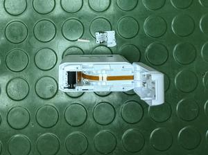](images/disassembly_5.jpg)  
the guide wheel removed

## step: 6 top insert removed
[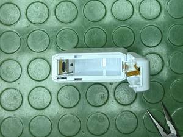](images/disassembly_6.jpg)  
the top insert removed

## step: 7 side panel removed
[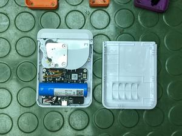](images/disassembly_7.jpg)  
side panel removed, pcb, motor drive, and battery exposed

## step: 8 battery detail
[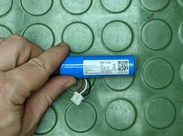](images/disassembly_8.jpg)  
battery detail

## step: 9 label drive removed
[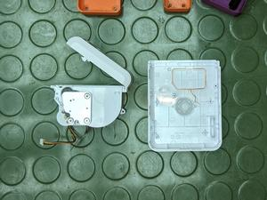](images/disassembly_9.jpg)  
label drive removed rfid antennae exposed

## step: 10 label drive detail
[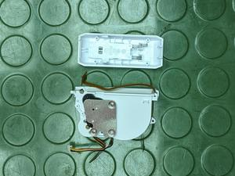](images/disassembly_10.jpg)  
detail photo of the label drive

## step: 11 thermal head detail
[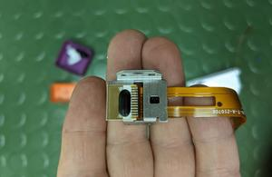](images/disassembly_11.jpg)  
thermal head detail

# pcb

## front
[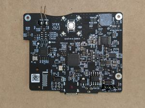](images/pcb_1_front.jpg)  

## back
[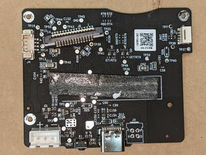](images/pcb_1_back.jpg)  

# parts_table
| designator | designator_image | oomp_key | note | description | description_lng | mpn | lcsc | link | 
| --- | --- | --- | --- | --- | --- | --- | --- | --- | 
| u1 | [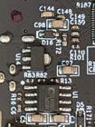](images/part_u1.jpg)  |  | battery management ic | battery management ic | battery management ic chiplink tech cl4056d | cl4056d | C2920852 | https://jlcpcb.com/partdetail/ChipLinkTech-CL4056D/C2920852 | 
| u7 | [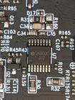](images/part_u7.jpg)  |  | stepper motor driver. Pinout compatible with drv8833 | dual h bridge driver | dual h bridge driver sa8833c pinout compatible with drv8833 | sa8833c | C3681295 | https://www.lcsc.com/product-detail/Motor-Driver-ICs_Texas-Instruments-DRV8833PW_C3681295.html | 
| u8 | [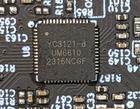](images/part_u8.jpg)  |  | main mcu. Has a bank of high current gpio | microcontroller | microcontroller with high current gpio bank yichip yc3121 | YC3121-L | C2916799 | https://jlcpcb.com/partdetail/YICHIP-YC3121L/C2916799 | 
| u11 | [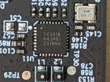](images/part_u11.jpg)  |  | rf chip | rf chip | rf chip yichip yc5018 | YC5018 | C2916804 | https://jlcpcb.com/partdetail/Yichip-YC5018/C2916804 | 
